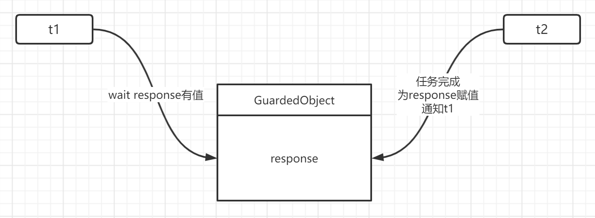
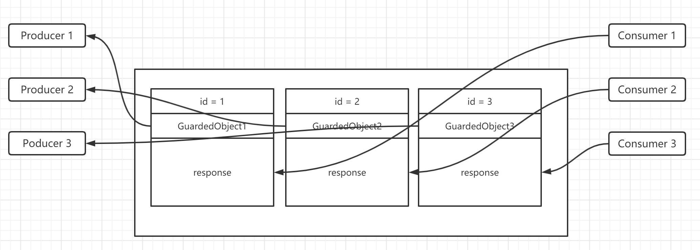

# 十一、保护性暂停

## （一）使用wait-notify的正确方式

### Step 1

查看代码，其实就是一个干活的程序，A同志需要抽烟才能干活，当他有了烟，他就会开始干活。

* 当A在睡觉的时候，他是不会释放锁的，即使烟提前到位了，也不会释放，效率低。
* 其他干活的线程都需要一直在阻塞。
* 解决方法，使用wait-notify

### Step 2

改进了使用wait-notify来控制暂停的情况，最大的改进就是A没烟的时候也不会阻塞其他人干活。

* 出现一个新问题，这个送烟的notify会不会叫醒其他人的wait呢？

### Step 3

如果此时使用notify就会发生虚假叫醒，要使用notifyAll

* 但是仍然叫醒了A，我们仅希望叫醒B

### Step 4

使用while来代替if，重复进入睡眠情况

### 总结

框架，基本模板。
```java
synchronzed(lock) {
    while (statement) {
        lock.wait();
    }
}

synchronized(lock) {
    lock.notifyAll();
}
```

## （二）定义

即 Guarded Suspension，用在一个线程等待另一个线程的执行结果。

要点:
* 有一个结果需要从一个线程传递到另一个线程，让他们关联同一个GuardedObject
* 如果有结果不断从一个线程传递到另一个线程那么可以使用消息队列（见下方生产者、消费者模式）
* JDK中，join的实现、Future的实现采用的就是此模式
* 因为要等到另一方的结果，因此归类到同步模式



## （三）实现

[参考代码](../../22-GuardedObject)

特点是可以在等待的同时做别的事情，相当于来了个容器存储结果。

## （四）增强

### 超时

在get方法增加超时参数。在超过时间后break掉（停止持续的恢复wait状态）

### 扩展2

当多个容器和多个生产者消费者情况下该怎么修改？

基本思路如下图:



## （五）生产者消费者模式

### 定义

要点:
* 与前面的保护性暂停的GuardObject不同，不需要产生结果和消费结果的线程一一对应
* 消费队列可以用来平衡生产和消费的线程资源
* 生产者仅负责产生结果数据，不关心数据该如何处理，而消费者专心处理结果数据
* 消息队列是有容量限制的，满时不会再加入数据，空时不会再消耗数据
* JDK中各种阻塞队列，采用的就是这种模式

### 实现

没什么好说的，看代码就行了，也不难。

[参考代码](../../)