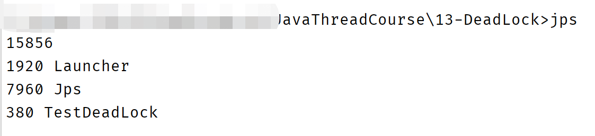
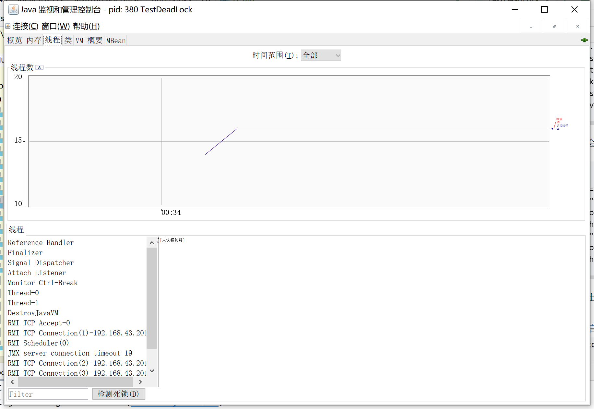
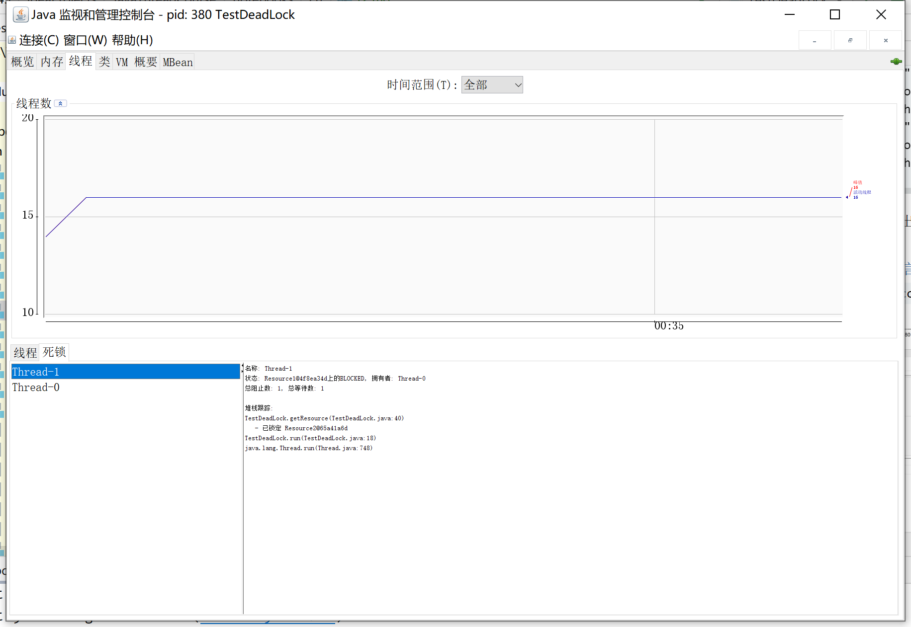

# 十二、多把锁

## （一）多把不相干的锁

在之前的学习，都是只是用一个对象进行加速，总是会出现一点问题的。

比如**并发度**就很低。

比如考虑以下代码的情况

[参考代码](../../24-MultiLock/src/sample/Sample1.java)

在这个例子里，一个房间想有两个人同时睡觉学习，就不成功。

只能依靠创建两个房间。

改进它，让他可以有两个锁！

[参考代码](../../24-MultiLock/src/sample/Sample2.java)

这个叫做，**锁粒度**。降低了锁粒度，同时也会造成死锁的情况。

## （二）活跃性

### 死锁

之前讲了，不多赘述。

### 定位死锁

检查死锁可以使用jconsole工具，或者使用jps定位进程id，再用jstack定位死锁。

我们通过[死锁](../../13-DeadLock/src/TestDeadLock.java)作为例子来试试。

1. 打开terminal，输入`jps`查看java进程id，查看得知是380

    

2. 输入`jstack <PID>`即`jstack 380`就能查看到线程信息。

    查看线程信息得到如下的信息，显示该线程状态是BLOCKED（阻塞）。
    ```text
    "Thread-1" #13 prio=5 os_prio=0 tid=0x000000001ee0f800 nid=0x347c waiting for monitor entry [0x000000001fd0f000]
    java.lang.Thread.State: BLOCKED (on object monitor)
        at TestDeadLock.getResource(TestDeadLock.java:40)
        - waiting to lock <0x000000076cf9da40> (a Resource1)
        - locked <0x000000076cf9f340> (a Resource2)
        at TestDeadLock.run(TestDeadLock.java:18)
        at java.lang.Thread.run(Thread.java:748)
    ```
    再往下看，能看到第四行的正在等待某个内存地址的锁。第五行显示了自己也锁住了一个锁。
   
    看下一个线程呢？一样的分析方法。
    ```text
    "Thread-0" #12 prio=5 os_prio=0 tid=0x000000001ee0e000 nid=0xef4 waiting for monitor entry [0x000000001fc0f000]
    java.lang.Thread.State: BLOCKED (on object monitor)
        at TestDeadLock.getResource(TestDeadLock.java:31)
        - waiting to lock <0x000000076cf9f340> (a Resource2)
        - locked <0x000000076cf9da40> (a Resource1)
        at TestDeadLock.run(TestDeadLock.java:18)
        at java.lang.Thread.run(Thread.java:748)
    ```   
   
    往下看，他会列出发现的死锁。
   
    ```text
    Found one Java-level deadlock:
    =============================
    "Thread-1":
    waiting to lock monitor 0x000000001ce33458 (object 0x000000076cf9da40, a Resource1),
    which is held by "Thread-0"
    "Thread-0":
    waiting to lock monitor 0x000000001ce30c78 (object 0x000000076cf9f340, a Resource2),
    which is held by "Thread-1"
    ```
   
    紧接着就列出了发现死锁的代码行数，消息十分清晰，也很方便。
   
    [完整的线程信息](./12-1.md)
   
3. 或者使用`jconsole`，连接到我们的线程。切换到线程界面。

    
   
    左下角就有个检查死锁，展示出哪些线程死锁，点击查看信息。
   
    
   
    另一个线程同理，不多赘述。

### 活锁

活锁出现在两个线程互相改变对方的条，导致最后谁也无法结束。

[参考代码](../../25-LiveLock)