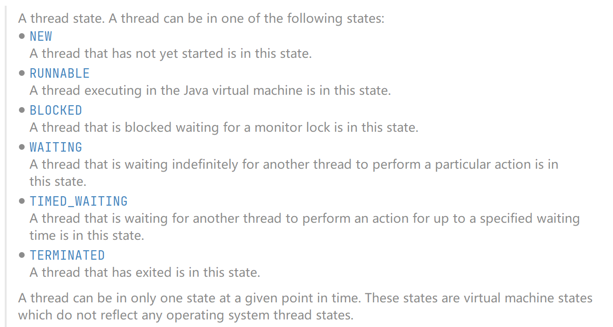

# 三、线程创建

## （一）三种创建方式

1. Thread.class：继承Thread类

2. Runnable接口：实现Runnable接口

3. Callable接口：实现Callable接口

### Thread类

[参考代码](../../01-Thread)

### Runnable接口实现

[参考代码](../../02-Runnable)

### Callable接口实现（了解）

[参考代码](../../03-Callable)

## （二）总结

### 继承Thread类

* 子类继承Thread具备多线程能力
* 启动线程：子类对象.start()
* 不建议使用：避免OOP单继承局限性

### 实现Runnable接口

* 实现接口Runnable具有多线程能力
* 启动线程：传入对象进Thread后start
* 推荐使用：避免单继承局限性、灵活方便、方便同一个对象被多个线程使用

## （三）静态代理

[参考代码](../../04-StaticProxy)

主要是类比Thread传入Runnable后开启多线程，其实就是静态代理。

## （四）Lambda

* 理解Function Interface是学习Java8 Lambda表达式的关键所在
* 函数式接口是什么？
    * 任何接口，如果只包含唯一一个抽象方法，那么他就是一个函数式接口
      
        例如Runnable.java
      
    * 对于函数式接口，我们可以通过Lambda表达式来创建该接口对象
    

## （五）线程状态

### 新生状态

```java
Thread t = new Thread();
```

线程对象一旦创建就进入了新生状态。

### 就绪状态

当调用了`start()`方法并不意味着线程立即调度执行，而是进入了就绪状态。

### 运行状态

经过CPU在线程的就绪和运行状态之间调度，进入运行状态，线程才真正执行线程提的代码块。

### 阻塞状态

当调用`sleep() wait()`或同步锁定时，线程进入阻塞状态，就是代码不往下执行，阻塞时间解除后，重新进入就绪状态，等待CPU调度执行。

### dead

线程中断或结束一旦进入死亡状态，就不能再次启动。

## （六）停止线程

* 不推荐使用JDK的`stop() destroy()`方法（已过时）

* 推荐线程自己停下来

* 建议使用标志位来停止线程

## （七）线程休眠

即`sleep()`

* sleep指定当前线程阻塞的毫秒数

* sleep存在异常InterruptedException

* sleep时间达到后线程进入就绪状态

* sleep可以模拟网络延时和倒计时等

* 每一个对象都有一个锁，sleep不会释放锁

## （八）线程礼让

[参考代码](../../07-TestYield)

* 礼让线程，让当前正在执行的线程暂停，但不阻塞

* 将线程运行状态转为就绪状态

* 让CPU重新调度，礼让不一定成功！

## （九）线程强制执行

[参考代码](../../08-TestJoin)

* join合并线程，待此线程执行完成后，在执行其他线程，其他线程阻塞

* 可以想象成实际生活中的插队

## （十）线程状态观测

[参考代码](../../09-ThreadState)

* Thread.State
    
    线程状态：
    * NEW
        
        尚未启动的线程位于此状态
      
    * RUNNABLE
      
      在JVM中运行的线程处于此状态  
      
    * BLOCKED
      
        被阻塞等待监视器锁定的线程处于此状态
      
    * WAITING
      
        正在等待另一个线程执行特定动作的线程处于此状态
      
    * TIMED_WAITING
      
        正在等待另一个线程执行动作达到指定等待时间的线程处于此状态
      
    * TERMINATED
    
        已退出的线程处于此状态
    
    一个线程可以在给定时间点处于一个状态。这些状态是不反应任何操作系统线程状态的虚拟机状态。
  



## （十一）线程优先级

[参考代码](../../10-TestPriority)

* Java提供一个线程调度器来监控程序启动后进入就绪状态的所有线程，线程调度器按照优先级决定应该调度那个线程来执行。

* 线程优先级用数字表示，从1到10
    * `Thread.MIN_PRIORITY = 1`
    * `Thread.MAX_PRIORITY = 10`
    * `Thread.NORM_PRIORITY = 5`
    
* 使用以下方式改变或获取优先级
```java
threadName.getPriority()
threadName.setPriority(2)
```

优先级低只是代表被调度的概率低，并不是完全按照优先级执行。

## （十二）守护(daemon)线程

[参考代码](../../11-TestDaemon)

* 线程分为用户线程和守护线程
* 虚拟机必须确保用户线程执行完毕
* 虚拟机不用等到守护线程执行完毕
* 如：后台记录操作日志、监控内存、垃圾回收等