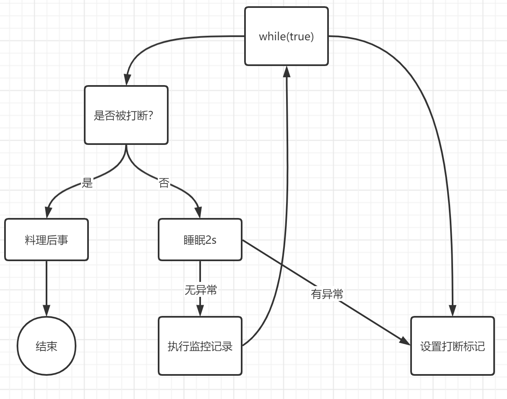

# 八、打断

`interrupt`

## （一）一般情况

* 可以打断阻塞状态的线程
  
  [参考代码](../../17-TestInterrupt/src/TestInterruptSleepThread.java)
  

* 可以打断运行状态的线程

  [参考代码](../../17-TestInterrupt/src/TestInterruptSleepThread.java)

## （二）两阶段终止 Two Phase Termination

[参考代码](../../17-TestInterrupt/src/TestTwoPhaseTermination.java)

### 细节

1. 打断sleep模式的线程会重置标志位
2. 打断监控时的线程就不会出现这样的情况
3. `static boolean interrupted()`也是获取打断标记，但是会清楚打断标记

## （三）打断park线程

[参考代码](../../17-TestInterrupt/src/TestInterruptPark.java)

## （四）不推荐的方法

1. stop()
2. suspend()
3. resume()

不会释放锁